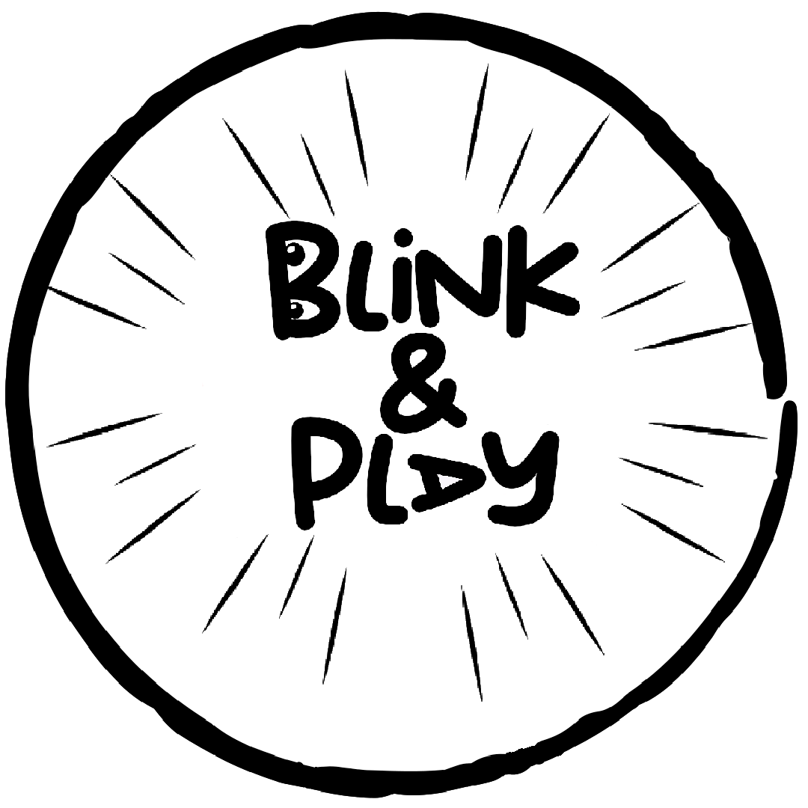

# Blink & Play

### Some people have something to say but they can't. We allow them to say it with the blink of an eye.

## Description
The project consists of a WebApp running on a device that communicates with other people via commands sent by thought through a neural headset. It is aimed at those who have disabilities in vocal communication and in the use of limbs, even for typing on a simple keyboard. The neural headset used is the EMOTIV EPOC+, equipped with electrodes that detect brain activity and translate it into commands. An artificial intelligence algorithm, trained to detect brain activity associated with certain emotions, actions and expressions, transmits the signals to an external device. The cerebral commands sent by the headset allow the user to navigate within the WebApp to construct the sentence relating to the user’s request. The captured commands are facial expressions: surprise, blinking and winking. The composed sentence will be reproduced with the speech synthesis of the device.